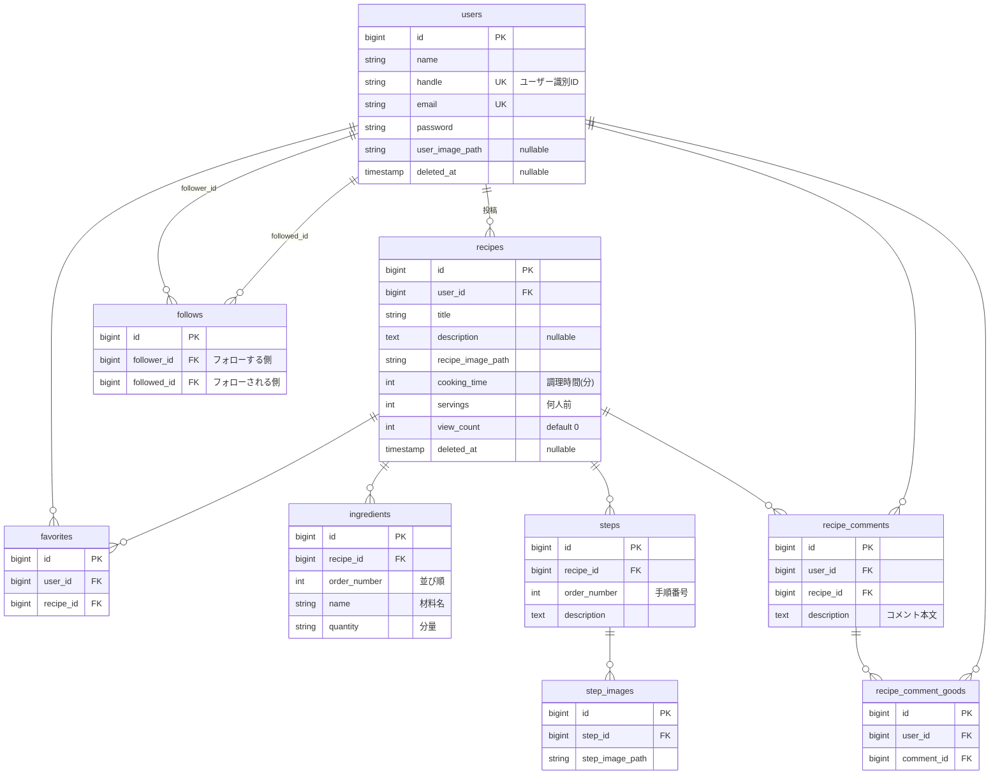

# Alacarte DB設計

レシピ共有アプリ Alacarte のデータベース設計。
マイグレーション作成時はこのドキュメントを正とする。

## 設計方針

- 全テーブルのPKは `bigint unsigned` = Laravelの `$table->id()`
- FKは `$table->foreignId()` を使い、PKと型を揃える
- テーブル名は snake_case 複数形に統一
- `created_at` / `updated_at` は `$table->timestamps()` で一括生成
- 論理削除が必要なテーブルのみ `deleted_at`（`$table->softDeletes()`）
- 中間テーブル的な性質を持つテーブル（follows / favorites / recipe_comment_goods）には
  必ず複合ユニーク制約を張り、重複レコードをDBレベルで防ぐ

## ER図

## テーブル一覧

| # | 物理名 | 論理名 | MVP |
|---|---|---|---|
| 1 | users | ユーザー情報 | ○ |
| 2 | follows | ユーザーフォロー情報 | ○ |
| 3 | recipes | レシピ情報 | ○ |
| 4 | ingredients | 材料情報 | ○ |
| 5 | steps | 料理手順情報 | ○ |
| 6 | step_images | 手順画像情報 | ○ |
| 7 | favorites | レシピお気に入り情報 | ○ |
| 8 | recipe_comments | レシピコメント情報 | ○ |
| 9 | recipe_comment_goods | コメントいいね情報 | ○ |
| 10 | recipe_drafts | 下書きレシピ情報 | △ 後回し |
| 11 | carts | カート情報 | △ 後回し |
| 12 | admin_users | 管理者ユーザー情報 | △ 後回し |
| 13 | recipe_categories | カテゴリ | × 除外（後述） |

## マイグレーション作成順（依存順）

1. users
2. follows
3. recipes
4. ingredients
5. steps
6. step_images
7. favorites
8. recipe_comments
9. recipe_comment_goods
10. recipe_drafts / carts / admin_users（後回し分）

---

## 1. users / ユーザー情報

| カラム | 型 | Null | 制約・備考 |
|---|---|---|---|
| id | bigint unsigned | | PK, AI |
| name | string | | ユーザーネーム |
| handle | string | | ユーザー識別ID, unique |
| email | string | | unique |
| email_verified_at | timestamp | ○ | |
| password | string | | |
| user_image_path | string | ○ | ユーザー画像パス |
| remember_token | string(100) | ○ | |
| deleted_at | timestamp | ○ | SoftDeletes |
| created_at / updated_at | timestamp | ○ | |

## 2. follows / フォロー情報

| カラム | 型 | Null | 制約・備考 |
|---|---|---|---|
| id | bigint unsigned | | PK, AI |
| follower_id | bigint unsigned | | FK → users.id, フォローする側 |
| followed_id | bigint unsigned | | FK → users.id, フォローされる側 |
| created_at / updated_at | timestamp | ○ | |

制約:
- `unique(follower_id, followed_id)` … 二重フォロー防止
- 自己フォロー禁止（`follower_id != followed_id`）はアプリ側バリデーションで担保

## 3. recipes / レシピ情報

| カラム | 型 | Null | 制約・備考 |
|---|---|---|---|
| id | bigint unsigned | | PK, AI |
| user_id | bigint unsigned | | FK → users.id |
| title | string | | レシピタイトル |
| description | text | ○ | 料理の説明文 |
| recipe_image_path | string | | |
| cooking_time | int | | 調理時間（分） |
| servings | int | | 何人前 |
| view_count | int unsigned | | default 0, 詳細閲覧時にインクリメント |
| deleted_at | timestamp | ○ | SoftDeletes |
| created_at / updated_at | timestamp | ○ | |

## 4. ingredients / 材料情報

| カラム | 型 | Null | 制約・備考 |
|---|---|---|---|
| id | bigint unsigned | | PK, AI |
| recipe_id | bigint unsigned | | FK → recipes.id, onDelete cascade |
| order_number | int | | 材料の並び順 |
| name | string | | 材料名 |
| quantity | string | | 材料の量（「大さじ1」等の自由入力） |

## 5. steps / 料理手順情報

| カラム | 型 | Null | 制約・備考 |
|---|---|---|---|
| id | bigint unsigned | | PK, AI |
| recipe_id | bigint unsigned | | FK → recipes.id, onDelete cascade |
| order_number | int | | 手順番号 |
| description | text | | 説明 |

## 6. step_images / 手順画像情報

| カラム | 型 | Null | 制約・備考 |
|---|---|---|---|
| id | bigint unsigned | | PK, AI |
| step_id | bigint unsigned | | FK → steps.id, onDelete cascade |
| step_image_path | string | | |

## 7. favorites / レシピお気に入り情報

| カラム | 型 | Null | 制約・備考 |
|---|---|---|---|
| id | bigint unsigned | | PK, AI |
| user_id | bigint unsigned | | FK → users.id |
| recipe_id | bigint unsigned | | FK → recipes.id |
| created_at / updated_at | timestamp | ○ | |

制約:
- `unique(user_id, recipe_id)` … 二重お気に入り防止

## 8. recipe_comments / レシピコメント情報

| カラム | 型 | Null | 制約・備考 |
|---|---|---|---|
| id | bigint unsigned | | PK, AI |
| user_id | bigint unsigned | | FK → users.id |
| recipe_id | bigint unsigned | | FK → recipes.id |
| description | text | | コメント本文 |
| created_at / updated_at | timestamp | ○ | |

## 9. recipe_comment_goods / コメントいいね情報

| カラム | 型 | Null | 制約・備考 |
|---|---|---|---|
| id | bigint unsigned | | PK, AI |
| user_id | bigint unsigned | | FK → users.id |
| comment_id | bigint unsigned | | FK → recipe_comments.id |
| created_at / updated_at | timestamp | ○ | |

制約:
- `unique(user_id, comment_id)` … 二重いいね防止

## 10. recipe_drafts / 下書きレシピ情報（後回し）

recipes とほぼ同一構造（view_count / deleted_at なし）。

検討事項: recipes に `status`（draft / published）カラムを持たせる案もある。
テーブルを分けると材料・手順も別テーブルが必要になり複雑化するため、
実装時にどちらの設計を採るか判断すること。

## 11. carts / カート情報（後回し）

| カラム | 型 | Null | 制約・備考 |
|---|---|---|---|
| id | bigint unsigned | | PK, AI |
| user_id | bigint unsigned | | FK → users.id |
| ingredient_id | bigint unsigned | | FK → ingredients.id |
| deleted_at | timestamp | ○ | SoftDeletes |
| created_at / updated_at | timestamp | ○ | |

## 12. admin_users / 管理者ユーザー情報（後回し）

users とほぼ同一構造（handle なし、image_path）。
別guardでの認証を想定。MVPでは実装しない。

## 13. recipe_categories（MVP除外）

**除外理由**: カラム構成がカテゴリを表現しておらず、recipes との関連付けもないため、
現状の設計ではレシピを分類できない。

カテゴリ機能を導入する場合の設計:
- `categories(id, name, slug)`
- `category_recipe(recipe_id, category_id)` … 多対多の中間テーブル

---

## Topページ2フィードのクエリ方針

- **みんなのレシピ（ランダム）**: recipes をランダム順で取得。
  `inRandomOrder()` は件数が増えると全件スキャンになり重くなるため、
  実装時にパフォーマンスを検証する。件数が増えたらID範囲からランダム抽出する方式に切り替える。
- **フォロー中**: ログインユーザーの follows から followed_id を引き、
  その users が持つ recipes を新着順で取得。

いずれも一覧表示時に投稿者情報とお気に入り数を参照するため、
`with('user')` / `withCount('favorites')` で N+1 を回避すること。